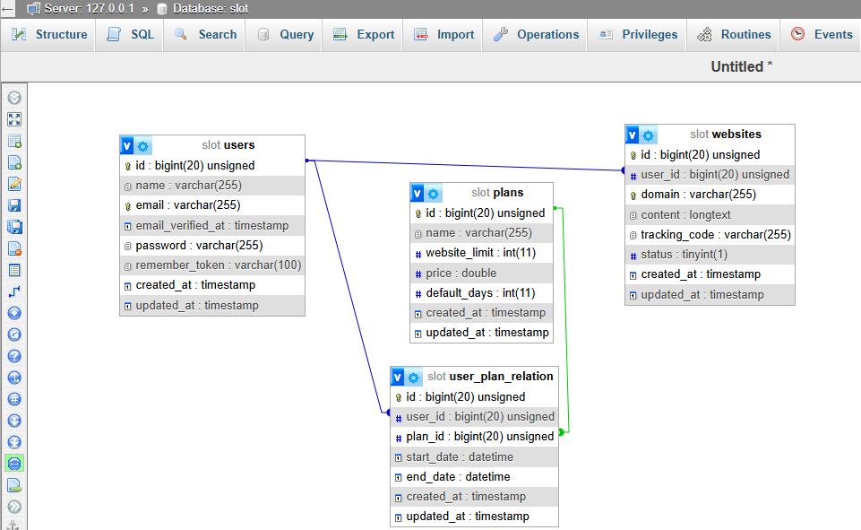

## Schema Design of Slog manager tool 

Noticable Changes at -

Migration tables --
    User, Plan, user-plan-pivot, Websites

3 Model:
    User,Plan,Website

Relationships 
    user<-many-to-many->plan
    user<-one-to-many->website

Middleware:
    Check the plan permission 

WebsiteController (Logic)
    1. assignPlan
    2. store 

Jobs
    DisableExpiredPlanWebsite

// Ignored
User creation
Plan Creation

